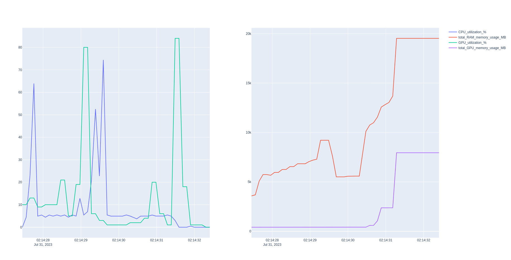

# pyprof
A simple profiler for all mankind 

## install
```
~$ git clone $$$

~$ cd pyprof

~$ pip install -r requirements.txt
```

## simple usage

```
from pyprof.profiler import Profiler

with Profiler(output_file_path='./') as prof:
    funky_func()
```

## example results

#### stdout:

```
########## CPU_utilization_% ##########
Peak: 74.425 %


########## total_RAM_memory_usage_MB ##########
Peak: 19519.48046875 MB


########## GPU_utilization_% ##########
Peak: 84.0 %


########## total_GPU_memory_usage_MB ##########
Peak: 7950.625 MB


########## total runtime ##########
0:00:04.035351
```

#### html file:


